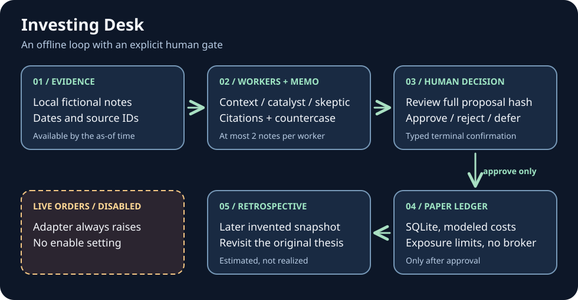

# Investing Desk

## What I want to build

I want to invest beyond the big-tech stocks, ETFs, and index funds I usually stick to, but I don't have the patience or time to research a wide range of opportunities myself. I want an agentic harness for investing: agents with tools that research long- and short-term opportunities and bring me analyst-style one-pagers I can review like a portfolio manager.

I also want agents to act on decisions and invest money in the market, monitor positions, and make shorter-term, higher-frequency decisions to optimize my portfolio. They should continually learn from retrospectives on what worked and what didn't, including strategy performance, and use market sentiment to guide new decisions. Independent workers should run continuously and in parallel under an orchestrator. Delegating real-money actions calls for clear authorization, enforceable risk limits, and reliable evaluation; manually approving every PAPER entry is not the end goal.

## What exists today

This Python 3.12 starter runs entirely offline; it is not an autonomous trading system. Two fictional companies, invented notes, and invented price snapshots live in `fixtures/scenario.json`. Three small, read-only workers select context, catalyst, and skeptic notes; each accepts at most two sources. The one-page Markdown memo repeats those claims with fixture IDs, publication and availability times, an as-of timestamp, a price citation, and a countercase. Future-dated evidence fails rather than quietly appearing in an earlier memo. There is no model call or data feed in this version.


[Read the current starter's decision loop as text](docs/decision-loop.md).

**Hypothetical example:** Orchid Relay Works has an invented board-certification review and an invented supplier delay that might undercut it. Its March fixture quote is $48. A person can inspect a three-share PAPER proposal and choose approve, reject, or defer; an invented April $44 snapshot then gives an approved position a retrospective question to revisit. Neither price is from a market.

From the repository root:

```sh
export PYTHONPATH=src
python3.12 -m investing_desk memo --company SIM-ORC
python3.12 -m investing_desk propose --company SIM-ORC --shares 3
# Copy the ID and full hash printed by propose:
ID='P-...'
HASH='...'
python3.12 -m investing_desk show --id "$ID"
python3.12 -m investing_desk decide --id "$ID" --hash "$HASH" --action approve --actor "Your label"
python3.12 -m investing_desk monitor --id "$ID" --through 2026-04-15T20:05:00Z
python3.12 -m investing_desk retrospective --id "$ID"
```

`decide` requires an interactive terminal and a typed confirmation; `reject` and `defer` record a decision without a position. Proposals expire after 24 hours. Approved PAPER entries live only in `.investing-desk/paper.sqlite3` (git-ignored), with a $10,000 invented starting balance, at most $500 committed per fictional company and $2,000 total, plus explicit assumed fees and slippage. The hash binds a decision to the reviewed memo and proposal; it does not authenticate a person or protect an editable local database.

The [roadmap](docs/roadmap.md) describes the path toward wider tool-assisted research, parallel monitoring, evaluation-driven adaptation, and authorized autonomous execution. None of those live capabilities is implemented here; the included `DisabledLiveOrderAdapter` has no enable switch. See also [research sources](docs/research.md) and the [data policy](docs/data-policy.md). Original code and artwork are MIT-licensed under [LICENSE](LICENSE). Run `PYTHONPATH=src python3.12 -m unittest discover -s tests -v` to check the starter. GitHub Actions runs the same offline suite on pushes and pull requests.
